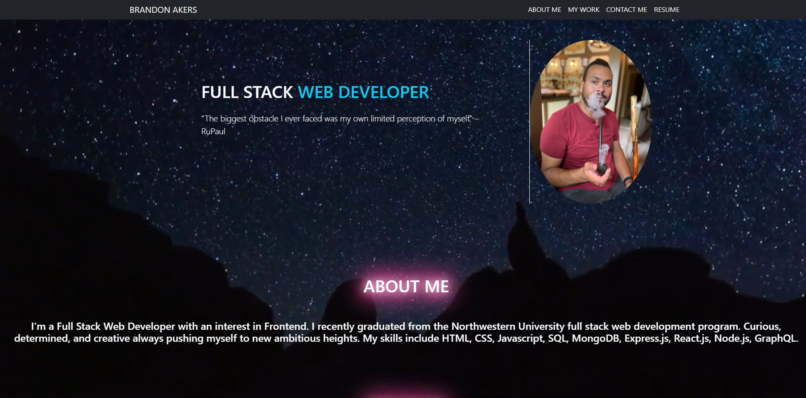
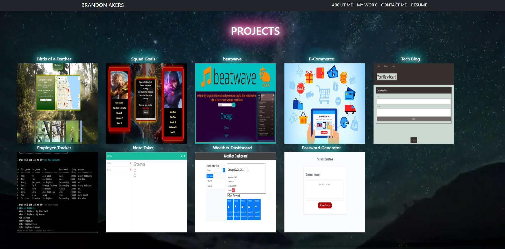

# Portfolio

## Description

This is my personal portfolio where I have showcased my work. I will continue to update this as I work on more applications. Here are a couple screenshots.

## Table of Contents

- [Installation](#Installation)
- [License](#License)
- [Questions](#Questions)

## Installation

You can view the deployed site here: https://codeb-a.github.io/Portfolio/

## License

MIT

## Questions

For additional information please contact me via GitHub at [https://github.com/codeb-a](https://github.com/codeb-a) or via email at [brandonakers729@gmail.com](mailto:brandonakers729@gmail.com?subject=[GitHub]%README%Generator).
